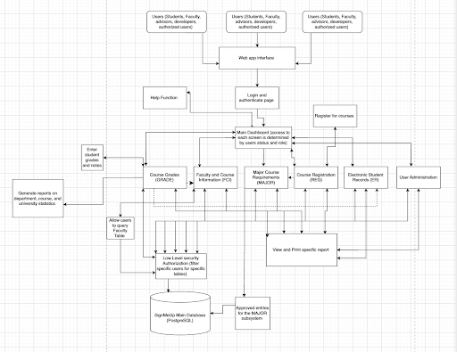

# SignMeUp

An application which will help students and staff nagivate course registration, student records, class information, faculty information, and student grades

## Developed by the 'Help Wanted Team'

```
Project Manager: Isha Shekhar

Configuration Manager: Elijah Uy

Software Manager: Amy Tran

Database Manager: Natalie Petersen

Test Manager: Justin Ogden

Software Developer: Anirudh Jha
```

## File Structure

```
SignMeUp/
├── README.md
├── database/
│    └── cs532_databasediagram.png
│    └── cs532_databasescript.sql
│
├── docs/
│   ├── Systems_architecture/
│   │   └── Sw_arch_532.png
│   ├── Uml/
│   │   └── use-case-diagram.png
│   ├── database/
│   │   └── cs532_databasediagram.png
│   ├── requirements/
│   │   └── Requirements.md
│   ├── tests/
│   │   └──Test methods and data.md
│   └── UI_wireframes/
│       └── wf_1.png
│       └── wf_2.png
│       └── wf_3.png


```

## Systems Architecture


